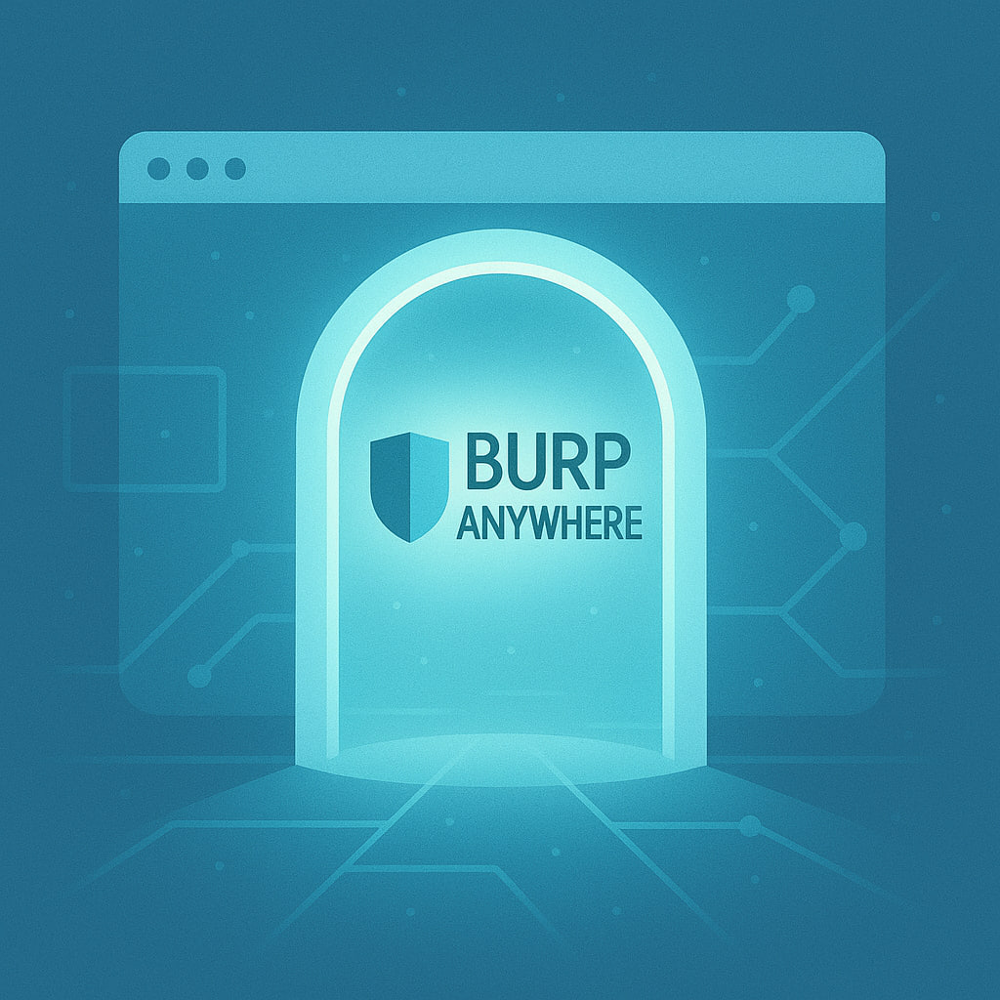

<p align="center">
   
</p>

# BurpAnywhere


Effortlessly run Burp Suite anywhere—right in your browser or on your desktop. BurpAnywhere delivers a seamless, portable, and secure web security testing environment powered by Docker. Instantly access Burp Suite with a modern browser (noVNC) or native X11, no installation required. Perfect for professionals and teams who want flexibility, speed, and security in their testing workflow.

---

## Table of Contents

1. [Project Layout](#project-layout)
2. [Prerequisites](#prerequisites)
3. [Quick Start](#quick-start)
4. [Configuration](#configuration)
5. [Managing the Burp Suite JAR](#managing-the-burp-suite-jar)
6. [Health Checks](#health-checks)
7. [Browser-Based UI Details](#browser-based-ui-details)
8. [Switching Between X11 and noVNC](#switching-between-x11-and-novnc)
9. [Troubleshooting](#troubleshooting)
10. [Cleanup](#cleanup)
11. [Restart Behavior](#restart-behavior)
12. [Running Without Docker Compose](#running-without-docker-compose)
13. [NGINX Reverse Proxy with SSL](#nginx-reverse-proxy-with-ssl)
14. [Security Notes](#security-notes)
15. [Support](#support)


## Project Layout

```
BurpAnywhere/
├─ .env, .env.example           # Environment variable files
├─ docker-compose.yml           # Docker Compose stack definition
├─ .logo/logo.png               # Project logo
├─ burp-app/
│  ├─ Dockerfile                # Container build definition
│  ├─ assets/
│  │   └─ index.html            # Embedded noVNC landing page
│  ├─ burpsuite.jar         # (Optional) Place Burp Suite JAR here for local mode
│  ├─ config/
│  │   ├─ project_options.json  # Burp project settings
│  │   └─ user_options.json     # User-specific settings
│  └─ scripts/
│      ├─ download.sh           # Fetches/links Burp Suite jar
│      └─ entrypoint.sh         # Boots Burp + virtual desktop/noVNC stack
├─ nginx/
│   └─ nginx.conf               # NGINX reverse proxy config
└─ README.md
```


## Prerequisites

- Docker installed
- Any modern browser to use the built-in noVNC UI
- (Optional) Docker Compose (for easier management)
- (Optional) X11 server if you want to display Burp on the host without the browser mode

## Quick Start

### 1. Configure Environment Variables

Copy the example environment file and customize it:

```bash
cp .env.example .env
```

Edit `.env` to match your requirements:

```env
BURPSUITE_VERSION=2025.11
BURPSUITE_TYPE=community
DISPLAY=host.docker.internal:0
BURP_PROXY_PORT=8080
```

### 2. Build the Docker Image

```bash
docker compose build
```

### 3. Run the Container

Using Docker Compose is recommended.

```bash
docker compose up -d
```


### 4. Open Burp in Your Browser

Once the containers are running, open `https://localhost/` in your browser when using the bundled NGINX reverse proxy (recommended). The proxy terminates TLS and forwards traffic to the internal noVNC service.

If you run the `burpsuite` container alone and expose noVNC (by uncommenting the `NOVNC_PORT` line in `docker-compose.yml`), open `http://localhost:6080/` instead. Use the default VNC password `burp` (change via `VNC_PASSWORD`) when prompted, and Burp Suite will load inside the noVNC window.


## Configuration


### Environment Variables

All environment variables are managed through the `.env` file. Key variables:

| Variable              | Description                                                      | Default         |
|-----------------------|------------------------------------------------------------------|-----------------|
| `BURPSUITE_VERSION`   | Burp Suite version to use                                        | 2025.11         |
| `BURPSUITE_TYPE`      | Edition type (`community` or `pro`)                              | community       |
| `BURPSUITE_MODE`      | `download` (fetch from PortSwigger) or `local` (use your JAR)    | download        |
| `BURPSUITE_HOME`      | Home directory for Burp user inside container                    | /home/burp      |
| `JAVA_OPTS`           | JVM options for performance tuning                               | See .env        |
| `DISPLAY`             | X11 display for GUI                                              | host.docker.internal:0 |
| `BURP_PROXY_PORT`     | Proxy listening port                                             | 8080            |
| `ENABLE_WEB_UI`       | Toggle browser-based (noVNC) UI                                 | true            |
| `VNC_DISPLAY`         | Virtual display identifier for Xvfb                             | :1              |
| `VNC_PORT`            | Port for raw VNC access                                         | 5901            |
| `NOVNC_PORT`          | Port exposed for browser-based access                           | 6080            |
| `NOVNC_WEB_DIR`       | Directory served as the noVNC web root                          | /usr/share/novnc|
| `XVFB_GEOMETRY`       | Resolution/depth for virtual display                            | 1920x1080x24    |
| `VNC_PASSWORD`        | Password protecting the VNC server                              | burp            |
| `RESTART_ON_EXIT`     | Restart Burp Suite if it exits (true/false/yes/no/1/0)          | true            |
| `RESTART_DELAY`       | Seconds to wait before restart                                  | 2               |
| `RESTART_MAX`         | Max restarts (0 = unlimited)                                    | 0               |
| `PROJECT_CONFIG_FILE` | Path to project options JSON inside container                   | config/project_options.json |
| `USER_CONFIG_FILE`    | Path to user options JSON inside container                      | config/user_options.json    |

### Configuration Files

- `burp-app/config/project_options.json` - Burp Suite project settings
- `burp-app/config/user_options.json` - User-specific settings


## Managing the Burp Suite JAR


The Dockerfile pulls the Burp Suite binary while the image is being built, so the container never needs to download anything at runtime.

### Download Mode (default)

Set `BURPSUITE_VERSION` and `BURPSUITE_TYPE` (via `.env` or build args) and run `docker compose build`. During the build, a helper script runs as the non-root `burp` user, downloads the requested release from PortSwigger, and stores it at `/home/burp/burpsuite.jar` inside the container.

### Local Mode

If you prefer to provide your own binary—e.g., Burp Suite Professional—place it at `burp-app/burpsuite.jar` and set `BURPSUITE_MODE=local` before building. The build step copies that file directly into `/home/burp` in the container, so proprietary bits stay out of the Docker layer history.


## Health Checks

The container includes a health check that verifies the Burp proxy is responding:

```bash
docker inspect --format='{{json .State.Health}}' burpsuite
```


## Browser-Based UI Details

- **URL (with bundled NGINX)**: `https://localhost/` (recommended when using the provided reverse proxy)
- **Direct noVNC URL**: `http://localhost:6080/` (only when you expose `NOVNC_PORT` in `docker-compose.yml` or run the container standalone)
- **Auto-launch**: The container now serves an embedded `index.html` that loads `vnc.html?autoconnect=1`, so you land directly in the Burp UI tab without picking files.
- **Auto-connect**: The noVNC proxy automatically forwards to the bundled VNC server on `localhost:${VNC_PORT}`.
- **Credentials**: The password defaults to `burp`; change it in `.env` via `VNC_PASSWORD`.
- **Raw VNC**: If you prefer a native VNC client, connect to `localhost:${VNC_PORT}` directly (only when exposed).
- **Disable browser mode**: Set `ENABLE_WEB_UI=false` to fall back to your host X11 display (just make sure you are exposing the ports if you need this method).


## Switching Between X11 and noVNC

This project supports two modes for running Burp Suite:

1. **X11 Mode**:
   - Set `ENABLE_WEB_UI=false` in your `.env` file to use your host's X11 display.
   - Ensure you have an X11 server running on your host (e.g., VcXsrv for Windows, XQuartz for macOS).
   - The `DISPLAY` variable should point to your host's X11 server (e.g., `DISPLAY=host.docker.internal:0`).

2. **noVNC Mode**:
   - Set `ENABLE_WEB_UI=true` in your `.env` file to enable the browser-based UI.
   - The container will start a virtual framebuffer (Xvfb) and noVNC server.
   - Access Burp Suite via `http://localhost:6080/` in your browser.

### Simultaneous Use

While the setup allows switching between X11 and noVNC, running both modes simultaneously is not supported out of the box. If you need both modes, consider running two separate containers with different configurations.


## Troubleshooting

### X11 or Browser UI Issues

- **Browser shows a grey screen**: Ensure the Burp container logs indicate `noVNC web client on port 6080` and that port 6080 is exposed.
- **Password rejected**: Make sure the `VNC_PASSWORD` value in `.env` matches what you're typing; recreate the container after changes.
- **Need raw X11**: If you still prefer X11, disable the browser UI and configure an X server (e.g., VcXsrv on Windows, XQuartz on macOS, or native X11 on Linux).

### Proxy Connection Issues

Verify the proxy is accessible:

```bash
curl -x http://localhost:8080 http://example.com
```

### Volume Permissions

Ensure the config directory has appropriate permissions:

```bash
chmod -R 755 ./config
```


## Cleanup

Stop and remove the container:

```bash
docker compose down
```

Remove the image:

```bash
docker rmi burpsuite:latest
```


## Restart Behavior

You can control automatic restart of Burp Suite using these environment variables in your `.env` file:

- `RESTART_ON_EXIT`: Set to `true`, `yes`, `1`, or `on` to enable automatic restart if Burp Suite exits. Set to `false`, `no`, or `0` to disable. Default: `true`.
- `RESTART_DELAY`: Number of seconds to wait before restarting Burp Suite. Default: `2`.
- `RESTART_MAX`: Maximum number of restart attempts. Set to `0` for unlimited restarts. Default: `0`.


Example usage in `.env`:

```env
RESTART_ON_EXIT=true
RESTART_DELAY=2
RESTART_MAX=0
```

---

## Running Without Docker Compose

You can build and run the container directly using Docker, without Compose. This is useful for custom setups or debugging.

### 1. Build the Image (Standalone)

Open a terminal in the `burp-app/` directory and run:

```powershell
cd burp-app
docker build -t burpsuite .
```

> **Note:** The Dockerfile expects to be built from within the `burp-app/` directory as context. All paths are relative to this folder.

### 2. Run the Container (Standalone)


You must provide the required environment variables and mount volumes manually. Here is an example:

```powershell
docker run -d `
   --name burpsuite `
   -e BURPSUITE_VERSION=2025.11 `
   -e BURPSUITE_TYPE=community `
   -e BURPSUITE_MODE=local `
   -e JAVA_OPTS="-Dawt.useSystemAAFontSettings=gasp -Dswing.aatext=true -Dsun.java2d.xrender=true -XX:+UnlockExperimentalVMOptions -XshowSettings:vm" `
   -e DISPLAY=host.docker.internal:0 `
   -e ENABLE_WEB_UI=true `
   -e VNC_DISPLAY=:1 `
   -e VNC_PORT=5901 `
   -e NOVNC_PORT=6080 `
   -e NOVNC_WEB_DIR=/usr/share/novnc `
   -e XVFB_GEOMETRY=1920x1080x24 `
   -e VNC_PASSWORD=burp `
   -e BURP_PROXY_PORT=8080 `
   -p 8080:8080 `
   # -p 6080:6080 `  # Uncomment to expose noVNC directly
   # -p 5901:5901 `  # Uncomment to expose raw VNC directly
   -v "${PWD}/config:/home/burp/config" `
   -v burp_data:/home/burp/.Burp `
   -v burp_prefs:/home/burp/.java/.userPrefs `
   burpsuite
```

> **Tip:** You can set additional variables or mount other volumes as needed. If you want to use a `.env` file, you can pass it with `--env-file ../.env` (from inside `burp-app/`), or manually specify variables as above.

### 3. Access the UI

When running standalone (or if you expose `NOVNC_PORT` in `docker-compose.yml`) open `http://localhost:6080/`. When you use the bundled NGINX reverse proxy, open `https://localhost/` instead.

The default VNC password is `burp`.

### 4. Clean Up

```powershell
docker stop burpsuite; docker rm burpsuite
```

### Named Volumes

If you want to persist data across runs, create Docker named volumes before running:

```powershell
docker volume create burp_data
docker volume create burp_prefs
docker volume create nginx_certs
```

Or use the `-v` flags as shown above to mount them.

---

## NGINX Reverse Proxy with SSL

The project includes an `nginx` service that acts as a reverse proxy for the `burpsuite` service. This provides TLS termination, optional WebSocket proxying for noVNC, and helps avoid direct exposure of internal container ports.

Key points:
- **TLS termination**: NGINX handles HTTPS on ports `80`/`443` and forwards traffic internally to the `burpsuite` noVNC service.
- **No direct noVNC exposure**: The `burpsuite` service's noVNC and VNC ports are intentionally not exposed on the host by default — access is meant to be through NGINX.
- **WebSocket support**: The proxy handles `/websockify` upgrades so the noVNC client works over TLS.

Access URLs (when NGINX is enabled in `docker-compose.yml`):
- **HTTPS (recommended)**: `https://localhost/`
- **HTTP**: `http://localhost/` (redirects to HTTPS by default)

Configuration and certificates:
- The NGINX config is in `nginx/nginx.conf`.
- Certificates are persisted in a Docker named volume called `nginx_certs` (mounted at `/etc/nginx/certs` inside the container). This keeps the generated certificates across container restarts and recreations.

Replacing or installing trusted certificates:
- For development, self-signed certs are generated automatically on container start and saved into the `nginx_certs` volume.
- To replace with production certificates from your host, copy them into the volume. Example (run from the project root):

```powershell
docker run --rm -v burpanywhere_nginx_certs:/etc/nginx/certs -v ${PWD}\nginx\mycerts:/tmp/mycerts busybox sh -c "cp /tmp/mycerts/* /etc/nginx/certs/"
docker compose restart nginx
```

Replace `burpanywhere_nginx_certs` above with your actual volume name if different (run `docker volume ls` to confirm). After replacing certs, restart the `nginx` service.

Notes:
- If you prefer direct access to the embedded noVNC in `burpsuite`, you can uncomment the `NOVNC_PORT` and `VNC_PORT` ports in `docker-compose.yml` — but this exposes those services directly on the host.
- Keep production TLS certs and private keys secure; do not commit them into the repository.

Start the full stack (with NGINX) using:

```powershell
docker compose up -d
```

If you make changes to NGINX config or certificates, run:

```powershell
docker compose restart nginx
```


## Security Notes

- The container runs as a non-root `burp` user for security
- Configuration files are mounted as volumes for persistence
- Sensitive data should not be stored in `.env`; use Docker secrets for production


## Support

For issues or questions, refer to:

- [Burp Suite Documentation](https://portswigger.net/burp/documentation)
- [Docker Documentation](https://docs.docker.com/)